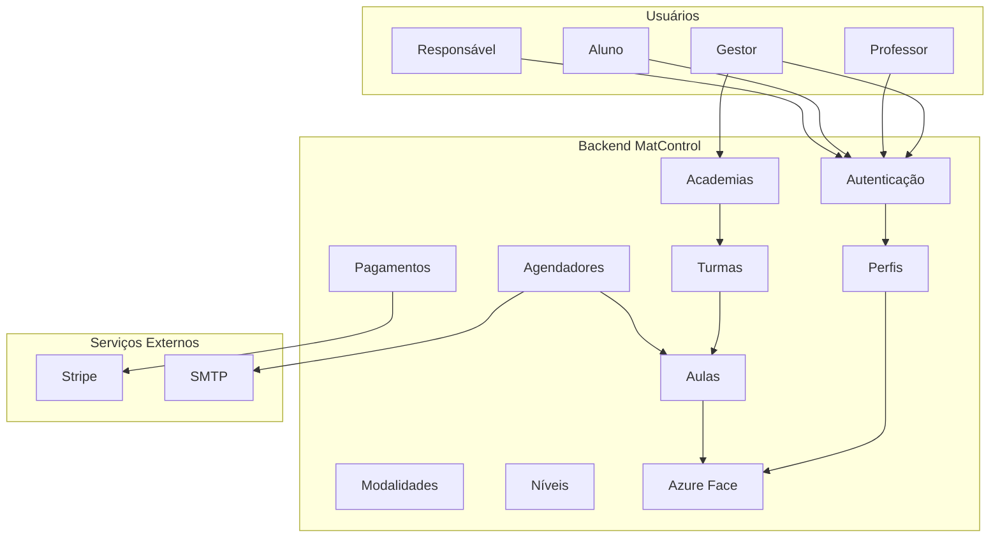
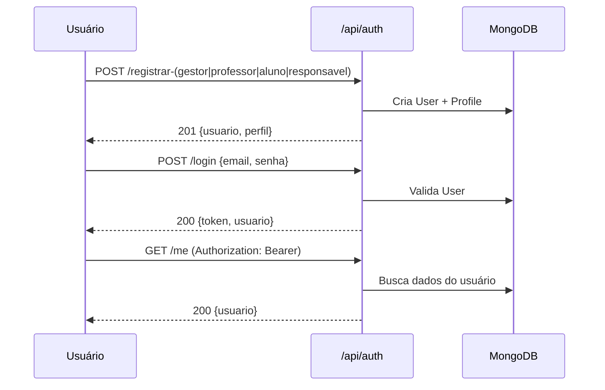
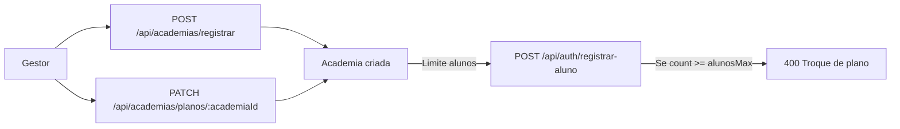
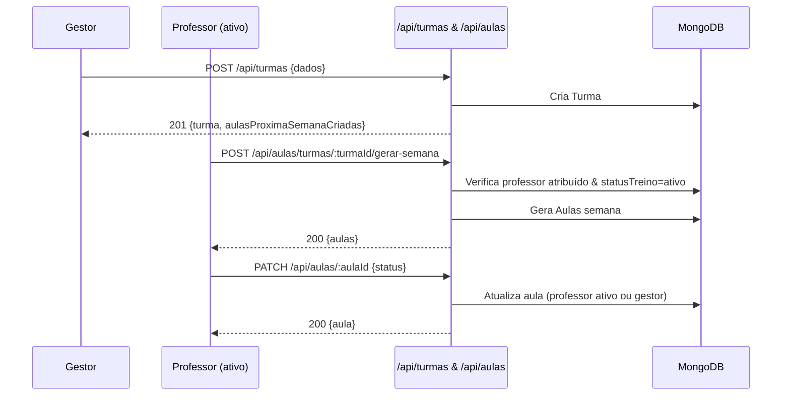
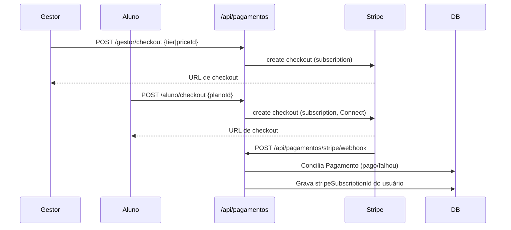
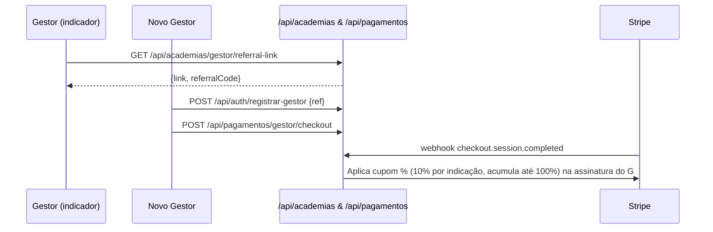
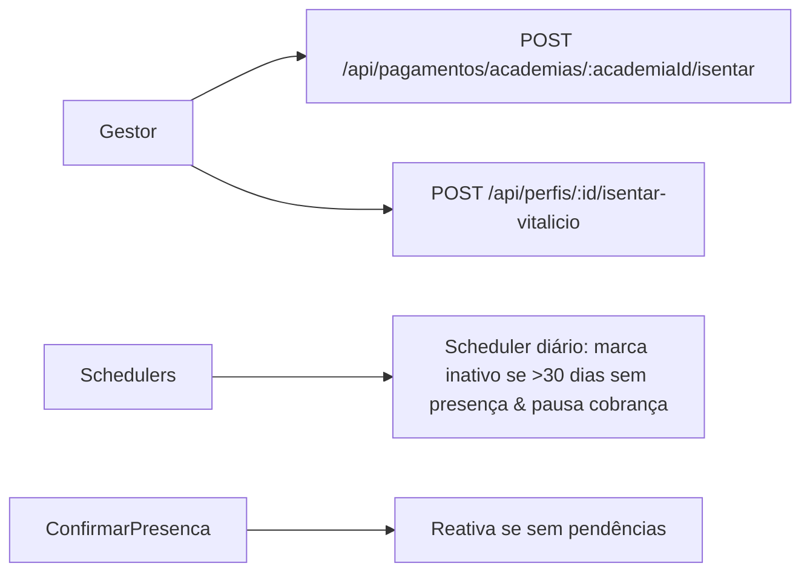
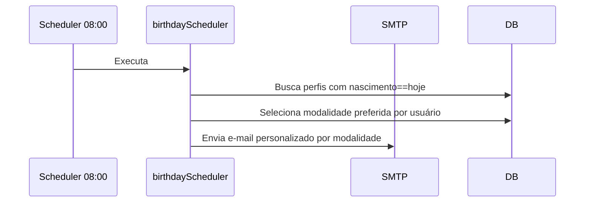

# Fluxograma Detalhado do MatControl

## Visão Geral de Componentes


## Autenticação e Perfis


## Fluxo de Academia e Planos


## Turmas e Aulas


## Presença e Status Automático
```mermaid
flowchart TD
  A[Aluno]-->Confirm[POST /api/aulas/:aulaId/confirmar]
  Confirm-->SetUltima[Atualiza ultimaPresencaEm]
  SetUltima-->Reativar[Se statusTreino=inativo e sem pendências, reativar]
  AulasSemChamada[Lista aulas]-->AutoStatus[Atualiza status (agendada/finalizada/aguardando chamada)]
```

## Reconhecimento Facial (Azure)
```mermaid
sequenceDiagram
  participant P as Professor/Gestor
  participant API as /api/perfis/azure/*
  participant Azure as Azure Face API
  P->>API: POST /api/perfis/azure/sincronizar-alunos
  API->>Azure: create person + add face + train
  API-->>P: 200 {pessoasCriadas, facesAdicionadas}
  P->>API: POST /api/aulas/:aulaId/chamada-automatica {imageUrl|imageBase64}
  API->>Azure: detect + identify
  API->>DB: Add confirmados; chamadaFeita
  API-->>P: 200 {confirmados, pendentes}
```

## Pagamentos e Assinaturas (Stripe)


## Programa de Indicação (Gestor)


## Isenções e Inatividade


## Felicitações de Aniversário


## Professor em Outra Academia
```mermaid
flowchart TD
  P[Professor ativo]-->TurmaOutraAcad[Turma pertence a outra academia]
  TurmaOutraAcad-->PermGerar[Pode gerar aulas]
  TurmaOutraAcad-->PermEditar[Pode editar/cancelar]
  TurmaOutraAcad-->PermChamada[Pode fazer chamada]
  note right of TurmaOutraAcad: Desde que seja o professor atribuído à turma
```

## Endpoints-Chave
- Autenticação: `/api/auth/registrar-*`, `/api/auth/login`, `/api/auth/me`
- Perfis: `/api/perfis/*`, inicialização e histórico
- Academias: `/api/academias/registrar`, `/api/academias/planos/:academiaId`, `/api/academias/gestor/referral-link`
- Turmas/Aulas: `/api/turmas/*`, `/api/aulas/*`
- Pagamentos: `/api/pagamentos/*`, webhook Stripe
- Azure Face: `/api/perfis/azure/*`
- Schedulers: Aulas semanais, inatividade, aniversários

## Variáveis de Ambiente (Principais)
- Banco/segurança: `MONGO_URI`, `JWT_SECRET`
- Frontend/CORS: `FRONTEND_URL`, `CORS_ORIGINS`, `APP_TIMEZONE`
- Azure: `AZURE_FACE_ENDPOINT`, `AZURE_FACE_KEY`, `AZURE_FACE_KEY_2`, `AZURE_FACE_PERSON_GROUP_ID`
- Stripe: `STRIPE_SECRET_KEY`, `STRIPE_WEBHOOK_SECRET`, `STRIPE_PLATFORM_PRICE_ID`
- SMTP: `SMTP_HOST`, `SMTP_PORT`, `SMTP_USER`, `SMTP_PASS`, `SMTP_FROM`